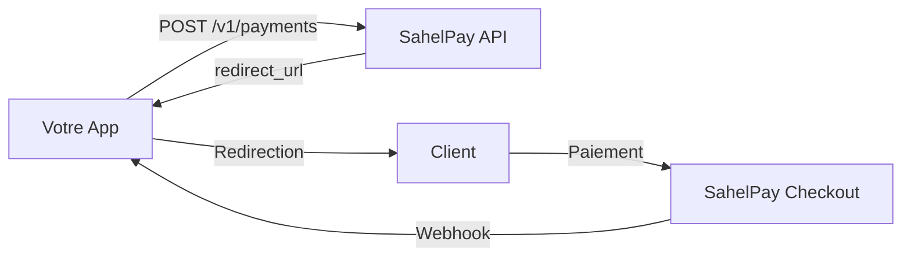

# Guide d'intégration

Ce guide détaille le flow complet d'intégration SahelPay pour une application marchande.

## Principes fondamentaux

<Warning>
  **Règles non négociables :**
  - Votre app est un **MERCHANT** SahelPay, pas un PSP
  - Votre app **NE calcule AUCUN frais** - SahelPay gère tout
  - Le **webhook est la SEULE source de vérité** pour le statut paiement
</Warning>

## Architecture



## Flow détaillé

### 1. Créer le paiement (Backend)

```javascript
// Votre API route: POST /api/payments/create
const response = await fetch('https://api.sahelpay.ml/v1/payments', {
  method: 'POST',
  headers: {
    'Authorization': `Bearer ${SAHELPAY_SECRET_KEY}`,
    'Content-Type': 'application/json',
    'X-Idempotency-Key': `order-${orderId}`, // Important!
  },
  body: JSON.stringify({
    amount: 5000,
    currency: 'XOF',
    payment_method: 'MOBILE_MONEY',
    country: 'ML',
    customer: { phone: '+22370123456' },
    return_url: `${APP_URL}/checkout/return?order_id=${orderId}`,
    client_reference: orderId,
    metadata: { order_id: orderId }
  })
});

const { data } = await response.json();
// Retourner data.redirect_url au frontend
```

### 2. Rediriger le client

```javascript
// Frontend
window.location.href = redirectUrl;
```

### 3. Recevoir le webhook

```javascript
// POST /api/webhooks/sahelpay
export async function POST(request) {
  const rawBody = await request.text();
  const signature = request.headers.get('x-sahelpay-signature');

  // TOUJOURS vérifier la signature
  if (!verifySignature(rawBody, signature, WEBHOOK_SECRET)) {
    return Response.json({ error: 'Invalid signature' }, { status: 401 });
  }

  const { event, data } = JSON.parse(rawBody);

  // Idempotence: vérifier si déjà traité
  const existing = await db.payments.findByTransactionId(data.id);
  if (existing?.status === 'success') {
    return Response.json({ received: true, already_processed: true });
  }

  switch (event) {
    case 'payment.success':
      await db.orders.update(data.metadata.order_id, { status: 'paid' });
      break;
    case 'payment.failed':
      // Laisser la commande en pending pour retry
      break;
  }

  return Response.json({ received: true });
}
```

## Idempotence

### Côté création

Utilisez `X-Idempotency-Key` basé sur l'order_id :

```javascript
headers: {
  'X-Idempotency-Key': `order-${orderId}`
}
```

### Côté webhook

Vérifiez si le paiement est déjà traité avant de mettre à jour :

```javascript
const existing = await db.payments.findByTransactionId(data.id);
if (existing?.status === 'success') {
  return { already_processed: true };
}
```

## Ce que votre app NE DOIT PAS faire

<CardGroup cols={2}>
  <Card title="❌ Appeler les providers directement" icon="xmark">
    Orange, Wave, CinetPay... Tout passe par SahelPay
  </Card>
  <Card title="❌ Calculer des frais" icon="xmark">
    SahelPay gère les frais automatiquement
  </Card>
  <Card title="❌ Créer un wallet" icon="xmark">
    Pas de stockage de solde dans votre app
  </Card>
  <Card title="❌ Marquer PAID sans webhook" icon="xmark">
    Le return_url est pour l'UX uniquement
  </Card>
</CardGroup>
