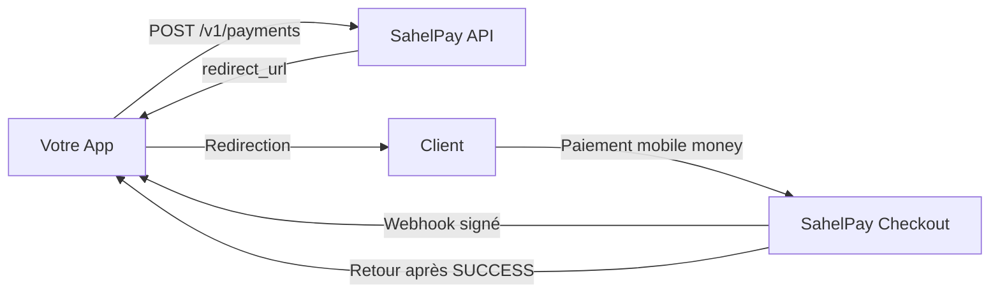

# Guide d'intégration

Ce guide détaille le flow complet d'intégration SahelPay pour une application marchande.

## Principes fondamentaux

<Warning>
  **Règles non négociables :**
  - Votre app utilise l'API SahelPay pour son propre usage : elle n'agit pas pour le compte de tiers
  - Les montants font foi tels que renvoyés par l'API : ne les recalculez pas côté client
  - Le **webhook est la seule source de vérité** pour le statut d'un paiement
</Warning>

## Architecture


```mermaid
flowchart LR
    A[Votre App] -->|POST /v1/payments| B[SahelPay API]
    B -->|redirect_url| A
    A -->|Redirection| C[Client]
    C -->|Paiement mobile money| D[SahelPay Checkout]
    D -->|Webhook signé| A
    D -->|Retour après SUCCESS| A
```

## Flow détaillé

### 1. Créer le paiement (backend)

```javascript
// Votre API route: POST /api/payments/create
const response = await fetch('https://api.sahelpay.ml/v1/payments', {
  method: 'POST',
  headers: {
    'Authorization': `Bearer ${SAHELPAY_SECRET_KEY}`,
    'Content-Type': 'application/json',
    'X-Idempotency-Key': `order-${orderId}`, // obligatoire
  },
  body: JSON.stringify({
    amount: 5000,
    currency: 'XOF',
    payment_method: 'ORANGE_MONEY', // seul moyen de paiement
    country: 'ML',
    customer_phone: '+22370123456',
    client_reference: orderId,
    return_url: `${APP_URL}/checkout/return?order=${orderId}`,
    hosted_checkout: true,
    metadata: { order_id: orderId }
  })
});

const { data } = await response.json();
// Retourner data.redirect_url au frontend
```

<Note>
  `client_reference` est renvoyé dans chaque webhook et sert à `GET /v1/payments/search`. C'est la clé la plus simple pour relier un paiement à votre commande. Les `metadata` personnalisées ne sont **pas** recopiées dans les webhooks (seuls `description` et `marketplace` le sont).
</Note>

### 2. Rediriger le client

```javascript
// Frontend
window.location.href = redirectUrl;
```

Le client valide auprès de l'opérateur. Si la page est rechargée ou si le client clique deux fois sur « Payer », le checkout reprend la même session de paiement au lieu d'en créer une nouvelle.

### 3. Recevoir le webhook

```javascript
// POST /api/webhooks/sahelpay
export async function POST(request) {
  const rawBody = await request.text();
  const signature = request.headers.get('x-sahelpay-signature');

  // TOUJOURS vérifier la signature sur le corps brut
  if (!verifySignature(rawBody, signature, WEBHOOK_SECRET)) {
    return Response.json({ error: 'Invalid signature' }, { status: 401 });
  }

  const { id: eventId, event, data } = JSON.parse(rawBody);

  // Idempotence : un même événement peut être livré plusieurs fois
  if (await db.webhookEvents.exists(eventId)) {
    return Response.json({ received: true, already_processed: true });
  }

  switch (event) {
    case 'payment.success':
      await db.orders.markPaid(data.client_reference, { payment_id: data.id });
      break;
    case 'payment.failed':
    case 'payment.expired':
      // Laisser la commande payable : le client peut réessayer
      break;
  }

  await db.webhookEvents.save(eventId);
  return Response.json({ received: true });
}
```

### 4. Page de retour

Après un paiement confirmé (`SUCCESS`), la page de paiement SahelPay redirige automatiquement le client vers votre `return_url` (HTTPS, hors domaines SahelPay). Aucun paramètre n'est ajouté : mettez votre référence de commande dans l'URL. Les paiements en attente ou échoués ne redirigent pas automatiquement.

## Idempotence

### Côté création

`X-Idempotency-Key` est obligatoire sur `POST /v1/payments` (128 caractères maximum). Basez-le sur votre commande :

```javascript
headers: {
  'X-Idempotency-Key': `order-${orderId}`
}
```

- Même clé + même demande : SahelPay renvoie le paiement déjà créé.
- Même clé + demande différente (montant, devise, téléphone, mode test/live) : erreur HTTP `409`.

### Côté webhook

Dédupliquez sur `id` du payload (identique au header `X-SahelPay-Event-ID`), puis vérifiez l'état de la commande avant de la mettre à jour.

## Ce que votre app NE DOIT PAS faire

<CardGroup cols={2}>
  <Card title="❌ Appeler l’opérateur directement" icon="xmark">
    Passez toujours par SahelPay
  </Card>
  <Card title="❌ Recalculer les montants" icon="xmark">
    Utilisez les montants renvoyés par l'API
  </Card>
  <Card title="❌ Agir pour des tiers" icon="xmark">
    L'API n'est pas un service de collecte pour d'autres vendeurs
  </Card>
  <Card title="❌ Marquer PAID sans webhook" icon="xmark">
    Le return_url est pour l'UX uniquement
  </Card>
</CardGroup>
