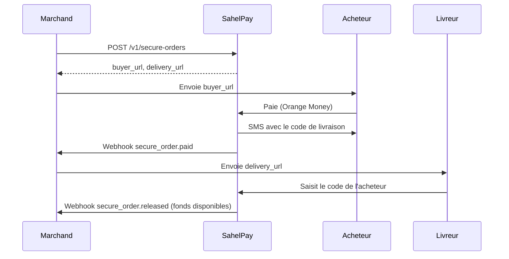

# Paiement sécurisé à la livraison

L'acheteur paie à la commande via Orange Money ; les fonds restent **bloqués** chez SahelPay jusqu'à ce que le livreur saisisse le **code de livraison** que l'acheteur reçoit par SMS. Sans livraison dans le délai, l'acheteur est remboursé automatiquement.

<Warning>
  **Fonctionnalité pilote, sur activation.** Le service est désactivé par défaut en production et ouvert
  marchand par marchand par SahelPay. S'il n'est pas activé pour votre compte, les appels renvoient
  `404 SECURE_ORDERS_DISABLED`. Il reste disponible en sandbox pour vos tests.
</Warning>

## Déroulé

## Statuts

| Statut | Description |
|--------|-------------|
| `CREATED` | Commande créée, en attente de paiement (payable 7 jours) |
| `PAID_HELD` | Payée, fonds bloqués jusqu'à la livraison |
| `RELEASED` | Code validé, fonds versés sur votre solde |
| `REFUNDED` | Acheteur remboursé (annulation, délai dépassé ou arbitrage) |
| `DISPUTED` | Litige ouvert par l'acheteur, arbitrage SahelPay |
| `CANCELLED` | Commande non payée annulée ou expirée |

## Règles

- Montant : 100 à 10 000 000 FCFA, en XOF.
- Délai de livraison : `delivery_deadline_hours` après le paiement (défaut 72 h, de 1 à 720 h).
- Code de livraison : 6 chiffres, **5 tentatives** maximum puis blocage (`429 CODE_LOCKED`).
- Délai dépassé : confirmation refusée (`410 DELIVERY_EXPIRED`) et remboursement automatique de l'acheteur.
- Annuler une commande payée la rembourse.

## Webhooks

| Événement | Quand |
|-----------|-------|
| `secure_order.paid` | Paiement reçu, fonds bloqués |
| `secure_order.released` | Livraison confirmée, fonds libérés |
| `secure_order.refunded` | Acheteur remboursé |
| `secure_order.disputed` | Litige ouvert |
| `secure_order.cancelled` | Commande non payée annulée |

Le `data` du webhook contient `id`, `reference`, `status`, `amount`, `currency`, `description`, `client_reference`, `payment_intent_id`, `is_test`, `delivery_deadline`, les motifs (`dispute_reason`, `cancel_reason`, `refund_reason`), `refund_id` et les horodatages (`created_at`, `paid_at`, `released_at`, `refunded_at`, `disputed_at`, `cancelled_at`). Il ne contient jamais les liens acheteur et livreur.

## Référence API

- [Créer](/api-reference/secure-orders/create)
- [Lister / détail](/api-reference/secure-orders/get)
- [Confirmer la livraison](/api-reference/secure-orders/confirm-delivery)
- [Annuler ou rembourser](/api-reference/secure-orders/cancel)

<Note>
  Les SDKs de ce dépôt n'exposent pas encore de méthodes pour les paiements sécurisés : utilisez l'API HTTP.
</Note>
