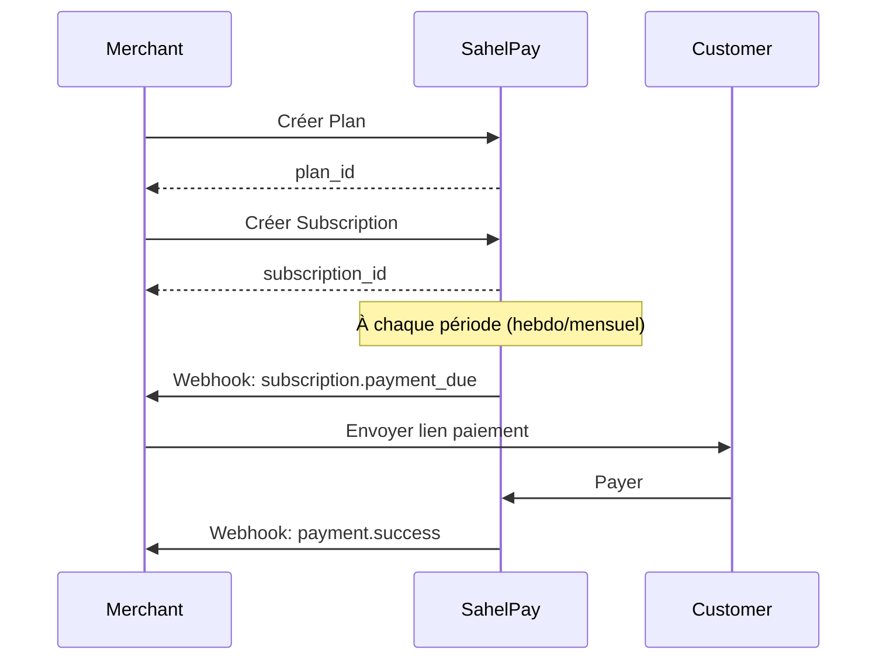

# Abonnements

Les **Abonnements** permettent de facturer vos clients de manière récurrente (hebdomadaire ou mensuelle) via Mobile Money.

## Concepts

- **Plan** : Définit le montant et la fréquence (hebdomadaire ou mensuel)
- **Subscription** : L'abonnement d'un client à un plan
- **Billing** : Paiement automatique à chaque période

## Créer un plan

D'abord, créez un plan d'abonnement :

<CodeGroup>

```javascript JavaScript
const plan = await sahelpay.plans.create({
  name: 'Premium Mensuel',
  amount: 10000,
  interval: 'MONTHLY', // ou 'WEEKLY'
  description: 'Accès premium mensuel'
});

console.log(plan.id); // plan_xxx
```

```python Python
plan = client.plans.create(
    name='Premium Mensuel',
    amount=10000,
    interval='MONTHLY',
    description='Accès premium mensuel'
)

print(plan['id'])  # plan_xxx
```

```php PHP
$plan = $sahelpay->plans->create([
    'name' => 'Premium Mensuel',
    'amount' => 10000,
    'interval' => 'MONTHLY',
    'description' => 'Accès premium mensuel'
]);

echo $plan->id; // plan_xxx
```

</CodeGroup>

## Créer un abonnement

Une fois le plan créé, créez un abonnement pour un client :

<CodeGroup>

```javascript JavaScript
const subscription = await sahelpay.subscriptions.create({
  plan_id: plan.id,
  customer_phone: '+22370123456',
  start_date: '2025-01-01' // Optionnel, défaut: maintenant
});

console.log(subscription.id);
console.log(subscription.next_billing_date);
```

```python Python
subscription = client.subscriptions.create(
    plan_id=plan['id'],
    customer_phone='+22370123456',
    start_date='2025-01-01'  # Optionnel
)

print(subscription['id'])
print(subscription['next_billing_date'])
```

```php PHP
$subscription = $sahelpay->subscriptions->create([
    'plan_id' => $plan->id,
    'customer_phone' => '+22370123456',
    'start_date' => '2025-01-01' // Optionnel
]);

echo $subscription->id;
echo $subscription->next_billing_date;
```

</CodeGroup>

## Créer un abonnement avec lien de paiement

Pour créer un abonnement ET générer immédiatement un lien de paiement :

```javascript
const result = await sahelpay.subscriptions.createWithPayment({
  plan_id: plan.id,
  customer_phone: '+22370123456',
  redirect_url: 'https://votre-site.com/billing?success=true',
  metadata: { user_id: 'user_123' }
});

console.log(result.subscription.id);
console.log(result.payment_link.url); // URL à envoyer au client
```

<Note>
  Cette méthode est idéale pour les intégrations SaaS où vous voulez envoyer immédiatement un lien de paiement au client.
</Note>

## Statuts d'abonnement

| Statut | Description |
|--------|-------------|
| `ACTIVE` | Abonnement actif, paiements en cours |
| `PAST_DUE` | Paiement en retard, retry automatique |
| `CANCELLED` | Abonnement annulé |

## Lister les abonnements

```javascript
const { subscriptions, pagination } = await sahelpay.subscriptions.list({
  plan_id: 'plan_xxx', // Optionnel
  status: 'ACTIVE',    // Optionnel
  limit: 20
});
```

## Annuler un abonnement

```javascript
await sahelpay.subscriptions.cancel(subscription.id);
```

L'abonnement sera annulé immédiatement. Les paiements futurs ne seront plus facturés.

## Webhooks

Les événements webhook pour les abonnements :

- `subscription.payment_due` : Paiement dû (génère un lien de paiement)
- `subscription.cancelled` : Abonnement annulé

```javascript
if (event === 'subscription.payment_due') {
  const { subscription_id, payment_url, billing_date } = data;
  
  // Envoyer le lien de paiement au client
  await sendPaymentLink(customer_phone, payment_url);
}
```

## Flow complet



## Exemple complet

```javascript
// 1. Créer le plan
const plan = await sahelpay.plans.create({
  name: 'Premium Mensuel',
  amount: 10000,
  interval: 'MONTHLY'
});

// 2. Créer l'abonnement avec lien de paiement
const result = await sahelpay.subscriptions.createWithPayment({
  plan_id: plan.id,
  customer_phone: '+22370123456',
  redirect_url: 'https://monapp.com/billing?success=true'
});

// 3. Envoyer le lien au client
await sendSMS('+22370123456', `Paiement: ${result.payment_link.url}`);

// 4. Gérer les webhooks
if (event === 'subscription.payment_due') {
  // Nouveau paiement dû, envoyer le lien
  await sendPaymentLink(data.customer_phone, data.payment_url);
}

if (event === 'subscription.cancelled') {
  // Abonnement annulé, désactiver l'accès
  await deactivateAccess(data.subscription_id);
}
```

## Plans publics

Pour afficher vos plans sur une page de pricing (sans authentification) :

```javascript
const { merchant, plans } = await SahelPay.getPublicPlans('merchant_id');

plans.forEach(plan => {
  console.log(`${plan.name}: ${plan.amount} ${plan.currency}/${plan.interval_label}`);
});
```

<Note>
  Les plans publics sont accessibles sans clé API, idéal pour les pages de pricing.
</Note>

