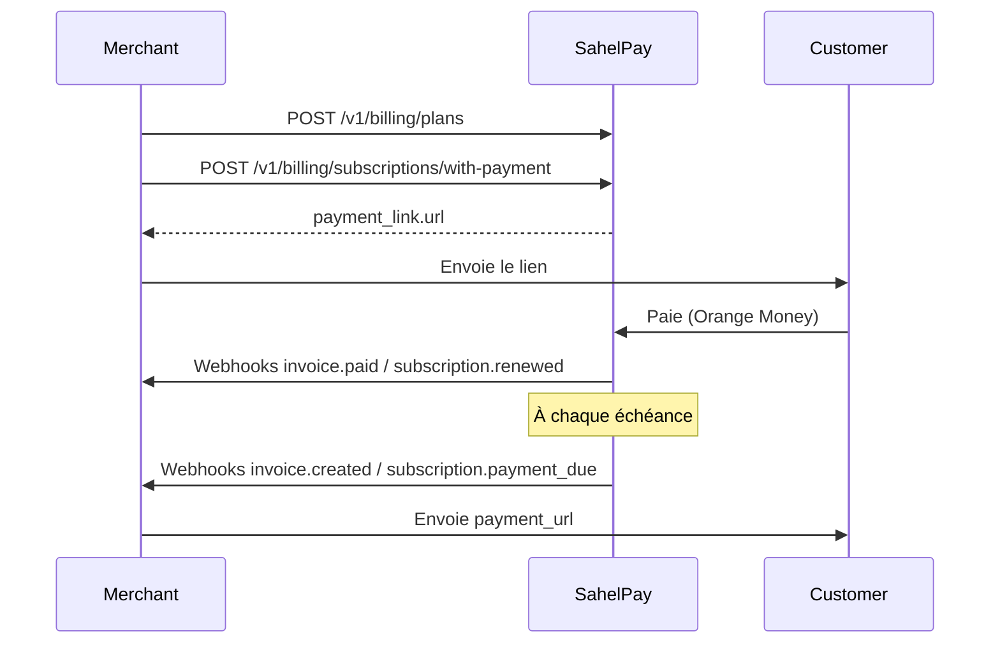

# Abonnements clients

Les **abonnements clients** permettent de facturer vos propres clients chaque semaine ou chaque mois via Orange Money. À chaque échéance, SahelPay crée une facture et un lien de paiement que vous transmettez au client.

<Note>
  Ne confondez pas avec l'abonnement **SahelPay** que vous payez pour encaisser en production
  (voir [Passer en production](/guides/going-live)).
</Note>

<Warning>
  Les routes sont sous `/v1/billing/...`. Les helpers `plans.*`, `subscriptions.*` et `customers.*` des SDKs
  de ce dépôt appellent encore d'anciennes routes (`/v1/plans`, `/v1/subscriptions`, `/v1/customers`) qui
  n'existent pas : utilisez l'API HTTP ci-dessous en attendant leur mise à jour.
</Warning>

## Concepts

- **Plan** : montant et fréquence (`WEEKLY` ou `MONTHLY`)
- **Abonnement** : un client (identifié par son téléphone) abonné à un plan
- **Facture** : créée à chaque échéance, payable via un lien de paiement

## Créer un plan

```bash
curl -X POST https://api.sahelpay.ml/v1/billing/plans \
  -H "Authorization: Bearer sk_test_xxx" \
  -H "Content-Type: application/json" \
  -d '{
    "name": "Premium Mensuel",
    "amount": 10000,
    "interval": "MONTHLY",
    "description": "Accès premium mensuel"
  }'
```

## Créer un abonnement avec lien de paiement (recommandé)

Crée l'abonnement au statut `INCOMPLETE`, une première facture et son lien de paiement. L'abonnement devient `ACTIVE` après le premier paiement.

```bash
curl -X POST https://api.sahelpay.ml/v1/billing/subscriptions/with-payment \
  -H "Authorization: Bearer sk_test_xxx" \
  -H "Content-Type: application/json" \
  -d '{
    "plan_id": "PLAN_ID",
    "customer_phone": "+22370123456",
    "redirect_url": "https://votre-site.com/billing?success=true",
    "metadata": { "user_id": "user_123" }
  }'
```

La réponse contient `subscription`, `invoice` et `payment_link.url` à transmettre au client.

`POST /v1/billing/subscriptions` crée directement un abonnement `ACTIVE` (avec `start_date` optionnelle) sans premier paiement.

## Statuts d'abonnement

| Statut | Description |
|--------|-------------|
| `INCOMPLETE` | Créé, premier paiement non effectué |
| `ACTIVE` | Abonnement actif |
| `PAST_DUE` | Paiement en retard |
| `CANCELLED` | Abonnement annulé |

## Lister et annuler

```bash
curl "https://api.sahelpay.ml/v1/billing/subscriptions?status=ACTIVE" \
  -H "Authorization: Bearer sk_test_xxx"

curl -X DELETE https://api.sahelpay.ml/v1/billing/subscriptions/SUBSCRIPTION_ID \
  -H "Authorization: Bearer sk_test_xxx"
```

## Webhooks

| Événement | Quand |
|-----------|-------|
| `invoice.created` | Nouvelle facture d'échéance, avec `payment_url` |
| `subscription.payment_due` | Même échéance (compatibilité), avec `payment_url` |
| `invoice.paid` | Facture réglée |
| `subscription.renewed` | Abonnement prolongé après paiement, avec `next_billing_date` |

```javascript
if (event === 'subscription.payment_due') {
  const { subscription_id, customer_phone, payment_url } = data;
  await sendPaymentLink(customer_phone, payment_url);
}
```

## Flow complet


```mermaid
sequenceDiagram
    participant Merchant
    participant SahelPay
    participant Customer

    Merchant->>SahelPay: POST /v1/billing/plans
    Merchant->>SahelPay: POST /v1/billing/subscriptions/with-payment
    SahelPay-->>Merchant: payment_link.url
    Merchant->>Customer: Envoie le lien
    Customer->>SahelPay: Paie (Orange Money)
    SahelPay->>Merchant: Webhooks invoice.paid / subscription.renewed

    Note over SahelPay: À chaque échéance
    SahelPay->>Merchant: Webhooks invoice.created / subscription.payment_due
    Merchant->>Customer: Envoie payment_url
```

## Plans publics

Pour une page de pricing sans authentification :

```javascript
import SahelPay from '@sahelpay/sdk';

const { merchant, plans } = await SahelPay.getPublicPlans('MERCHANT_ID');
```

Endpoint : `GET /v1/public/plans?merchant_id=...` (public).
