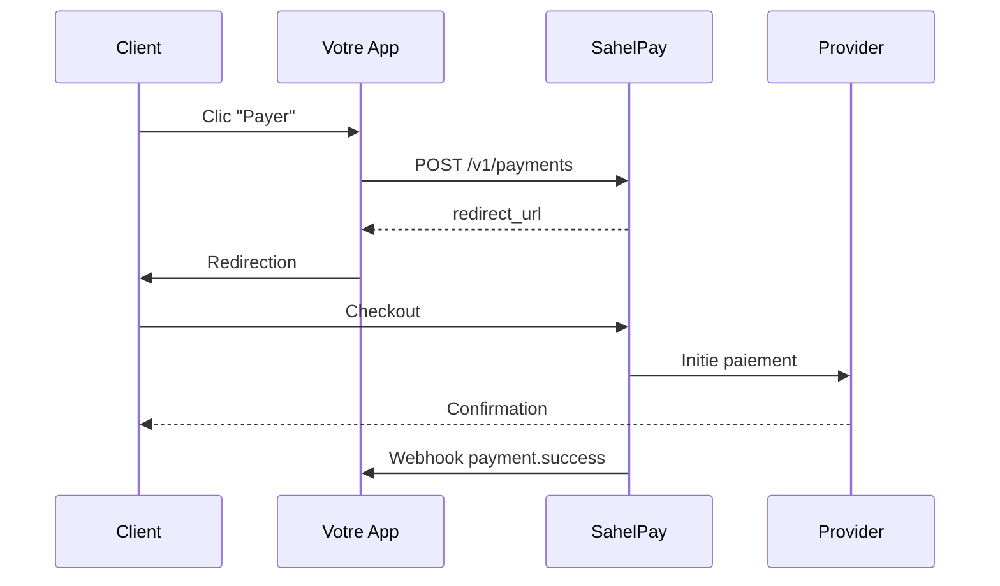

# Bienvenue sur SahelPay

SahelPay est une API de paiement unifiée pour l'Afrique de l'Ouest. Acceptez les paiements Mobile Money (Orange Money, Wave, Moov) et les cartes bancaires (VISA, Mastercard, GIM-UEMOA) avec une seule intégration.

## Pourquoi SahelPay ?

<CardGroup cols={2}>
  <Card title="API Unifiée" icon="code">
    Une seule intégration pour Mobile Money et cartes bancaires
  </Card>
  <Card title="Smart Routing" icon="route">
    Choix automatique du meilleur provider selon coût et disponibilité
  </Card>
  <Card title="Checkout Hébergé" icon="credit-card">
    Page de paiement sécurisée, sans certification PCI-DSS
  </Card>
  <Card title="Webhooks Fiables" icon="webhook">
    Notifications en temps réel avec retry automatique
  </Card>
  <Card title="Abonnements" icon="repeat">
    Paiements récurrents avec plans et subscriptions
  </Card>
  <Card title="Customer Portal" icon="user">
    Portail client self-service pour gérer abonnements et paiements
  </Card>
  <Card title="Payouts" icon="send">
    Envoi d'argent vers Mobile Money (paiement fournisseurs, salaires)
  </Card>
  <Card title="SDKs Officiels" icon="box">
    JavaScript, PHP, Python - prêts à l'emploi
  </Card>
</CardGroup>

## Flow de paiement

## Premiers pas

<Steps>
  <Step title="Créer un compte">
    Inscrivez-vous sur [dashboard.sahelpay.ml](https://dashboard.sahelpay.ml)
  </Step>
  <Step title="Récupérer vos clés API">
    Dans le dashboard, section **Développeurs** → **Clés API**
  </Step>
  <Step title="Intégrer">
    Suivez le [guide de démarrage rapide](/quickstart)
  </Step>
</Steps>

## Environnements

| Environnement | URL | Clés |
|---------------|-----|------|
| **Sandbox** | `https://sandbox.sahelpay.ml` | `sk_test_xxx` |
| **Production** | `https://api.sahelpay.ml` | `sk_live_xxx` |

## Méthodes de paiement supportées

| Type | Méthodes | Pays |
|------|----------|------|
| **Mobile Money** | Orange Money, Wave, Moov | Mali, Sénégal, CI, Bénin, Togo |
| **Cartes Bancaires** | VISA, Mastercard, GIM-UEMOA | Tous |

<Note>
  Utilisez toujours l'environnement **Sandbox** pour vos tests. Les transactions sandbox ne sont pas facturées.
</Note>

## Fonctionnalités principales

- **Paiements** : Collecte de paiements Mobile Money et cartes bancaires
- **Liens de paiement** : Créer des liens réutilisables pour vos produits
- **Abonnements** : Paiements récurrents avec plans (hebdomadaire, mensuel)
- **Customer Portal** : Portail client pour gérer abonnements et historique
- **Payouts** : Envoi d'argent vers Mobile Money (fournisseurs, salaires, remboursements)
- **Webhooks** : Notifications en temps réel pour tous les événements
- **Smart Routing** : Optimisation automatique du coût et de la disponibilité
