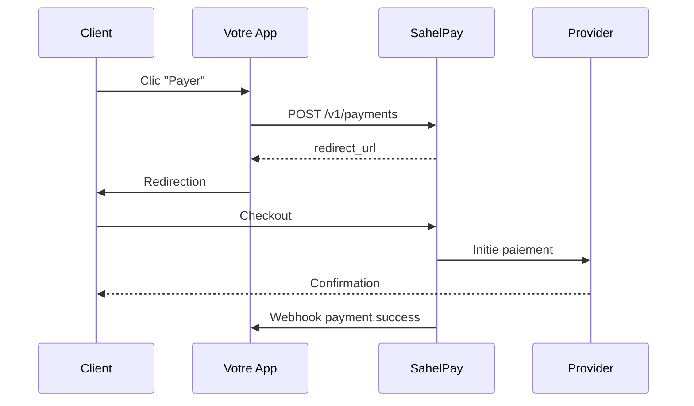

# Bienvenue sur SahelPay

SahelPay est une API de paiement unifiée qui permet d'accepter les paiements Mobile Money (Orange Money, Wave, Moov, MTN) en Afrique de l'Ouest.

## Pourquoi SahelPay ?

<CardGroup cols={2}>
  <Card title="API Unifiée" icon="code">
    Une seule intégration pour tous les providers Mobile Money
  </Card>
  <Card title="Checkout Hébergé" icon="credit-card">
    Page de paiement sécurisée, sans certification PCI-DSS
  </Card>
  <Card title="Webhooks Fiables" icon="webhook">
    Notifications en temps réel avec retry automatique
  </Card>
  <Card title="SDKs Officiels" icon="box">
    JavaScript, PHP, Python - prêts à l'emploi
  </Card>
</CardGroup>

## Flow de paiement

## Premiers pas

<Steps>
  <Step title="Créer un compte">
    Inscrivez-vous sur [dashboard.sahelpay.ml](https://dashboard.sahelpay.ml)
  </Step>
  <Step title="Récupérer vos clés API">
    Dans le dashboard, section **Développeurs** → **Clés API**
  </Step>
  <Step title="Intégrer">
    Suivez le [guide de démarrage rapide](/quickstart)
  </Step>
</Steps>

## Environnements

| Environnement | URL | Clés |
|---------------|-----|------|
| **Sandbox** | `https://sandbox.sahelpay.ml` | `sk_test_xxx` |
| **Production** | `https://api.sahelpay.ml` | `sk_live_xxx` |

<Note>
  Utilisez toujours l'environnement **Sandbox** pour vos tests. Les transactions sandbox ne sont pas facturées.
</Note>
