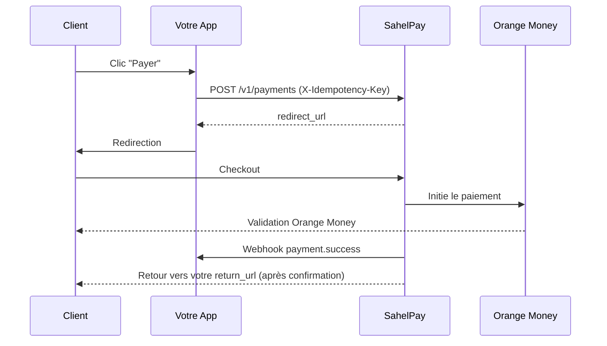

# Bienvenue sur SahelPay

SahelPay est une API de paiement pour les marchands au Mali. **Orange Money (Mali) est le seul moyen de paiement disponible.** Wave, Moov et les cartes bancaires ne sont pas proposés : toute autre valeur de `provider` est rejetée avec une erreur `400`.

## Pourquoi SahelPay ?

<CardGroup cols={2}>
  <Card title="API REST" icon="code">
    Une intégration unique pour encaisser via Orange Money
  </Card>
  <Card title="Confirmation vérifiée" icon="shield-check">
    Un paiement n'est confirmé qu'après contrôle auprès de l'opérateur
  </Card>
  <Card title="Checkout hébergé" icon="credit-card">
    Page de paiement hébergée par SahelPay, retour automatique vers votre site après confirmation
  </Card>
  <Card title="Webhooks fiables" icon="webhook">
    Notifications signées avec retry automatique
  </Card>
  <Card title="Paiement sécurisé à la livraison" icon="truck">
    Fonds bloqués jusqu'à la remise du colis (pilote, sur activation)
  </Card>
  <Card title="Sandbox gratuite" icon="flask">
    Testez toute l'intégration sans abonnement
  </Card>
  <Card title="Abonnements clients" icon="repeat">
    Plans récurrents et portail client self-service
  </Card>
  <Card title="SDKs officiels" icon="box">
    JavaScript, PHP, Python
  </Card>
</CardGroup>

## Flow de paiement

```mermaid
sequenceDiagram
    participant Client
    participant Votre App
    participant SahelPay
    participant Orange as Orange Money

    Client->>Votre App: Clic "Payer"
    Votre App->>SahelPay: POST /v1/payments (X-Idempotency-Key)
    SahelPay-->>Votre App: redirect_url
    Votre App->>Client: Redirection
    Client->>SahelPay: Checkout
    SahelPay->>Orange: Initie le paiement
    Orange-->>Client: Validation Orange Money
    SahelPay->>Votre App: Webhook payment.success
    SahelPay-->>Client: Retour vers votre return_url (après confirmation)
```

## Premiers pas

<Steps>
  <Step title="Créer un compte">
    Inscrivez-vous sur [app.sahelpay.ml](https://app.sahelpay.ml/register)
  </Step>
  <Step title="Récupérer vos clés API">
    Dans le dashboard, section **Développeurs** → **Clés API**
  </Step>
  <Step title="Intégrer en sandbox">
    Suivez le [guide de démarrage rapide](/quickstart). La sandbox est gratuite.
  </Step>
  <Step title="Passer en production">
    KYC validé, activation par SahelPay et abonnement payé : voir [Passer en production](/guides/going-live).
  </Step>
</Steps>

## Environnements

| Environnement | URL | Clés | Abonnement |
|---------------|-----|------|------------|
| **Sandbox** | `https://api.sahelpay.ml` | `sk_test_xxx` | Non requis |
| **Production** | `https://api.sahelpay.ml` | `sk_live_xxx` | Abonnement payé et actif requis |

<Warning>
  Les encaissements live sont plafonnés par votre forfait (200 000 FCFA par mois civil pour Starter et Pro).
  Voir [Passer en production](/guides/going-live).
</Warning>

## Méthode de paiement

| Méthode | Statut | Pays |
|---------|--------|------|
| `ORANGE_MONEY` | ✅ Disponible | Mali |

Sur la page Orange Money, le paiement apparaît sous le libellé `SPAY-<nom du marchand>` (30 caractères maximum) pour que votre client vous reconnaisse.

<Note>
  Utilisez toujours une clé `sk_test_...` pour vos tests. Pour simuler un paiement sans aucun appel opérateur, envoyez `metadata.sahelpay_mock: true` (option `mock` des SDKs).
</Note>

## Fonctionnalités principales

- **Paiements** : collecte Orange Money avec checkout hébergé
- **Liens de paiement** : liens réutilisables à montant fixe ou libre
- **Webhooks** : notifications signées pour chaque changement de statut
- **Retraits** : demandes de retrait de votre solde vers Orange Money, traitées manuellement par SahelPay
- **Paiement sécurisé à la livraison** : séquestre jusqu'à la remise (pilote, sur activation)
- **Programme Partenaires SPAY** : SahelPay vend en son nom les produits validés de votre catalogue
- **Abonnements clients** et **Customer Portal**

<Note>
  Les remboursements en ligne, les payouts automatiques et les splits ne sont pas disponibles. Voir l'[historique des changements](/resources/changelog).
</Note>
