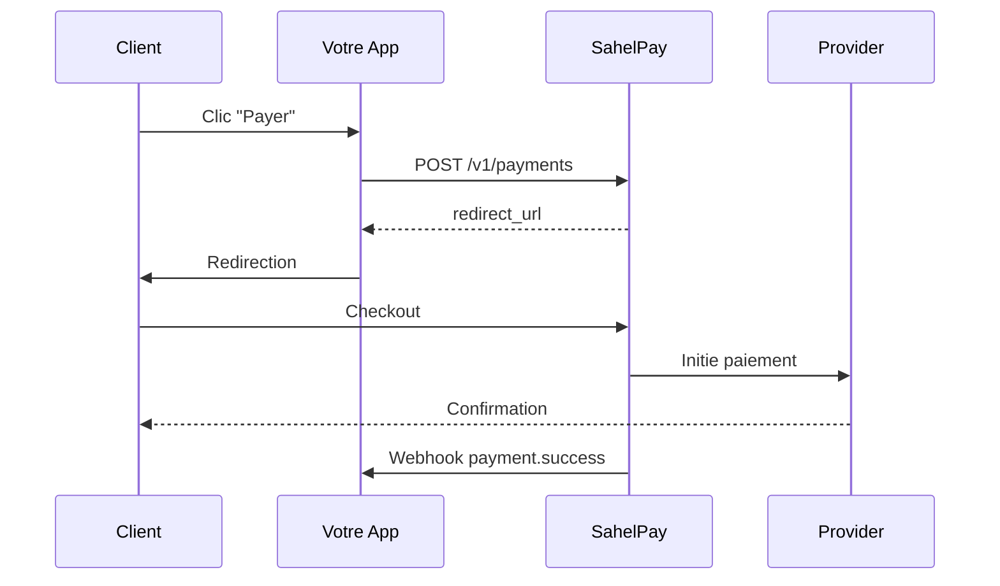

# Bienvenue sur SahelPay

SahelPay est une API de paiement pour l'Afrique de l'Ouest. **Orange Money (Mali) est le rail actuellement disponible.** Les autres opérateurs et les cartes bancaires sont en feuille de route et ne sont pas encore intégrés.

## Pourquoi SahelPay ?

<CardGroup cols={2}>
  <Card title="API REST" icon="code">
    Une intégration unique, pensée pour accueillir d'autres rails sans changer votre code
  </Card>
  <Card title="Confirmation vérifiée" icon="shield-check">
    Un paiement n'est confirmé qu'après contrôle auprès de l'opérateur
  </Card>
  <Card title="Checkout Hébergé" icon="credit-card">
    Page de paiement hébergée par SahelPay
  </Card>
  <Card title="Webhooks Fiables" icon="webhook">
    Notifications en temps réel avec retry automatique
  </Card>
  <Card title="Abonnements" icon="repeat">
    Paiements récurrents avec plans et subscriptions
  </Card>
  <Card title="Customer Portal" icon="user">
    Portail client self-service pour gérer abonnements et paiements
  </Card>
  <Card title="Payouts" icon="send">
    Envoi d'argent vers Orange Money (paiement fournisseurs, salaires)
  </Card>
  <Card title="SDKs Officiels" icon="box">
    JavaScript, PHP, Python - prêts à l'emploi
  </Card>
</CardGroup>

## Flow de paiement

```mermaid
sequenceDiagram
    participant Client
    participant Votre App
    participant SahelPay
    participant Provider
    
    Client->>Votre App: Clic "Payer"
    Votre App->>SahelPay: POST /v1/payments
    SahelPay-->>Votre App: redirect_url
    Votre App->>Client: Redirection
    Client->>SahelPay: Checkout
    SahelPay->>Provider: Initie paiement
    Provider-->>Client: Confirmation
    SahelPay->>Votre App: Webhook payment.success
```

## Premiers pas

<Steps>
  <Step title="Créer un compte">
    Inscrivez-vous sur [dashboard.sahelpay.ml](https://dashboard.sahelpay.ml)
  </Step>
  <Step title="Récupérer vos clés API">
    Dans le dashboard, section **Développeurs** → **Clés API**
  </Step>
  <Step title="Intégrer">
    Suivez le [guide de démarrage rapide](/quickstart)
  </Step>
</Steps>

## Environnements

| Environnement | URL | Clés |
|---------------|-----|------|
| **Sandbox** | `https://api.sahelpay.ml` | `sk_test_xxx` |
| **Production** | `https://api.sahelpay.ml` | `sk_live_xxx` |

## Méthodes de paiement supportées

| Méthode | Statut | Pays |
|---------|--------|------|
| `ORANGE_MONEY` | ✅ Disponible | Mali |

<Warning>
  Orange Money est le seul rail intégré. Toute autre valeur de `provider` est
  rejetée avec une erreur `400`. La liste des méthodes réellement activées pour
  votre compte est exposée par `GET /v1/providers/enabled` — interrogez-la plutôt
  que de coder la liste en dur.
</Warning>

<Note>
  Utilisez toujours une clé `sk_test_...` pour vos tests. Pour simuler un paiement sans aucun appel opérateur, envoyez `metadata.sahelpay_mock: true`.
</Note>

## Fonctionnalités principales

- **Paiements** : Collecte de paiements Orange Money
- **Liens de paiement** : Créer des liens réutilisables pour vos produits
- **Abonnements** : Paiements récurrents avec plans (hebdomadaire, mensuel)
- **Customer Portal** : Portail client pour gérer abonnements et historique
- **Payouts** : Envoi d'argent vers Orange Money (fournisseurs, salaires, remboursements)
- **Webhooks** : Notifications en temps réel pour tous les événements
