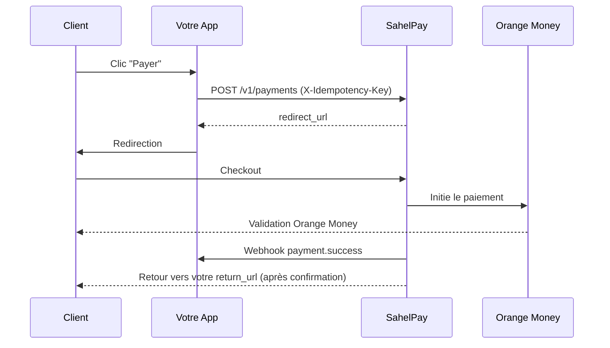

# Bienvenue sur SahelPay

SahelPay est une API technique de paiement au Mali : documentation, sandbox, webhooks signés et idempotence. **Orange Money (Mali) est le seul moyen de paiement disponible.** Wave, Moov et les cartes bancaires ne sont pas proposés : toute autre valeur de `provider` est rejetée avec une erreur `400`.

## Pourquoi SahelPay ?

<CardGroup cols={2}>
  <Card title="API REST" icon="code">
    Une intégration unique pour les paiements Orange Money
  </Card>
  <Card title="Confirmation vérifiée" icon="shield-check">
    Un paiement n'est confirmé qu'après contrôle auprès de l'opérateur
  </Card>
  <Card title="Checkout hébergé" icon="credit-card">
    Page de paiement hébergée par SahelPay, retour automatique vers votre site après confirmation
  </Card>
  <Card title="Webhooks fiables" icon="webhook">
    Notifications signées avec retry automatique
  </Card>
  <Card title="Idempotence" icon="rotate">
    `X-Idempotency-Key` sur chaque création : un retry ne crée jamais de doublon
  </Card>
  <Card title="Sandbox gratuite" icon="flask">
    Testez toute l'intégration sans abonnement
  </Card>
  <Card title="Abonnements clients" icon="repeat">
    Plans récurrents et portail client self-service
  </Card>
  <Card title="SDKs officiels" icon="box">
    JavaScript, PHP, Python
  </Card>
</CardGroup>

## Flow de paiement

```mermaid
sequenceDiagram
    participant Client
    participant Votre App
    participant SahelPay
    participant Orange as Orange Money

    Client->>Votre App: Clic "Payer"
    Votre App->>SahelPay: POST /v1/payments (X-Idempotency-Key)
    SahelPay-->>Votre App: redirect_url
    Votre App->>Client: Redirection
    Client->>SahelPay: Checkout
    SahelPay->>Orange: Initie le paiement
    Orange-->>Client: Validation Orange Money
    SahelPay->>Votre App: Webhook payment.success
    SahelPay-->>Client: Retour vers votre return_url (après confirmation)
```

## Premiers pas

<Steps>
  <Step title="Demander l'accès">
    L'ouverture de compte se fait sur demande : écrivez à [support@sahelpay.africa](mailto:support@sahelpay.africa?subject=Demande%20d%27acc%C3%A8s%20SahelPay)
  </Step>
  <Step title="Récupérer vos clés API">
    Dans le dashboard, section **Développeurs** → **Clés API**
  </Step>
  <Step title="Intégrer en sandbox">
    Suivez le [guide de démarrage rapide](/quickstart). La sandbox est gratuite.
  </Step>
  <Step title="Passer en production">
    Sur demande, après validation et contrat distinct : voir [Passer en production](/guides/going-live).
  </Step>
</Steps>

## Environnements

| Environnement | URL | Clés | Accès |
|---------------|-----|------|-------|
| **Sandbox** | `https://api.sahelpay.ml` | `sk_test_xxx` | Gratuit |
| **Production** | `https://api.sahelpay.ml` | `sk_live_xxx` | Sur demande, après validation et contrat distinct |

<Note>
  L'accès à la production est soumis à une validation et à des conditions distinctes précisant son périmètre et les rôles de chaque partie. Voir [Passer en production](/guides/going-live).
</Note>

## Méthode de paiement

| Méthode | Statut | Pays |
|---------|--------|------|
| `ORANGE_MONEY` | ✅ Disponible | Mali |

<Note>
  Utilisez toujours une clé `sk_test_...` pour vos tests. Pour simuler un paiement sans aucun appel opérateur, envoyez `metadata.sahelpay_mock: true` (option `mock` des SDKs).
</Note>

## Fonctionnalités principales

- **Paiements** : création et suivi de paiements Orange Money avec checkout hébergé
- **Liens de paiement** : liens réutilisables à montant fixe ou libre
- **Webhooks** : notifications signées pour chaque changement de statut
- **Idempotence** : création rejouable sans doublon
- **Programme Partenaires SPAY** : SahelPay vend en son nom les produits validés de votre catalogue
- **Abonnements clients** et **Customer Portal**

<Note>
  SAHEL PAY TECHNOLOGIES (SPAY) n'est pas une banque ni un établissement de paiement agréé par la BCEAO.
</Note>
